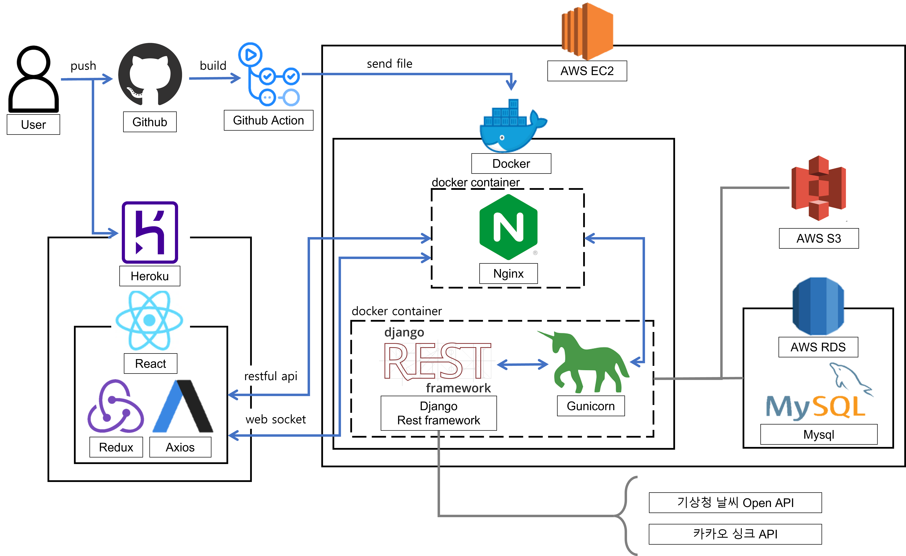
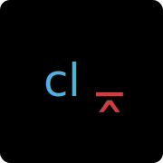

# dnd-7th-4-frontend

## 🧑🏻‍💻 Developer

|      | 이동현 [@L2HYUNN](https://github.com/L2HYUNN)  | 김해나 [@kimhn0605](https://github.com/kimhn0605)  | 이지아 [@zeroto99](https://github.com/zeroto99)|
|------|------|---|---|

## 🗺 Architecture

## 🛠 Tech Stack

<!-- ### ✔️ Infra

|Docker|Github Actions|
|:---:|:---:|
|| -->

### ✔️ JavaScript Library

|React|
|---|
|  | 

### ✔️ CSS Framework

|Styled-components|
|---|
| 

 |

### ✔️ State Management Tools

|Recoil|
|---|
|  | 

### ✔️ Lint & Formatter

| eslint | prettier | commitlint | 
----------------------------------------------------------|----------------------------------------------------------------|--------------------------------------------------------------|
|  |  | 
 

### ✔️ Test Tools

|Storybook|
|---|
| 

 | 

